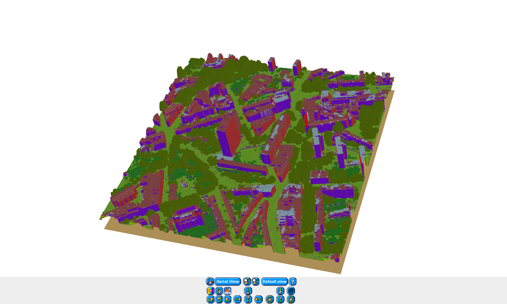

# DART-atmos-corr
A place for code and tutorials for atmospheric correction of longwave infrared camera imagery using the [Discrete Anisotropic Radiative Transfer (DART)](http://www.cesbio.ups-tlse.fr/us/dart.html) model.

This repository is being constantly updated with [tutorials](tutorials) and [code](code) to give readers of Morrison *et al.* (2019) (in press) a hands-on guide to performing atmospheric and emissivity corrections for longwave infrared camera imagery across complex terrain.

## Summary of atmospheric correction routine 
The overall routine is summarised in the below flowchart. Click on a flowchart element to be directed to the appropriate documentation (WIP).

<!-- ```{r echo = FALSE, warning = FALSE} -->
<!-- library(DiagrammeR) -->
<!-- DiagrammeR::mermaid(' -->
<!-- graph TB -->
<!--             A(Real world image)-->B(Configure Blender model world)             -->
<!--             B-->C(Create multi line of sight image) -->
<!--             B-->D(Run DART atmosphere simulation) -->
<!--             C-->E -->
<!--             D-->E -->
<!--             E(Post process images)-->F(Band calculation and correction) -->
<!--             A-->F -->
<!--             F-->G(Analysis) -->
<!--             click A "https://github.com/willmorrison1/DART-atmos-corr" "Real world image guide" -->
<!--             click B "https://github.com/willmorrison1/DART-atmos-corr" "Model world creation guide" -->
<!--             click C "https://github.com/willmorrison1/DART-atmos-corr" "Multi line of sight image creation guide" -->
<!--             click D "https://github.com/willmorrison1/DART-atmos-corr" "DART atmosphere simulation guide" -->
<!--             click E "https://github.com/willmorrison1/DART-atmos-corr" "Simulation post-processing guide" -->
<!--             click F "https://github.com/willmorrison1/DART-atmos-corr" "Band calculation and real world image correction guide" -->
<!--             click G "https://github.com/willmorrison1/DART-atmos-corr" "Image analysis guide"') -->

<!-- ``` -->

A software package has been developed to work with DART outputs: [daRt for the R programming language](https://github.com/willmorrison1/daRt) and complements the atmospheric correction processing and analysis. daRt methods are being developed to simplify the atmospheric correction process. 


*DART "Scene 3D" view of central London area (430 m x 430 m) used for testing of DART atmospheric correction.*


