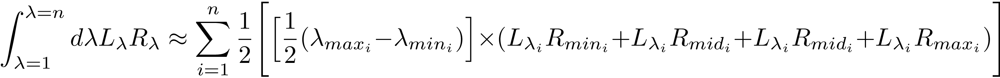
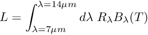

# Summary 

This section demonstrates methods for correcting [real world](../Real-world-images) thermal images using [DART simulation](../DART-simulation) results. The [script files](README_files/code) contain the code for the functions executed below.

```{r, warning = FALSE, message = FALSE}
library(daRt)
library(dplyr)
library(ggplot2)
simDir <- "../../tutorials/DART-simulation/README_files/DART-simulation/dart-atmos-corr"
sF_trans <- daRt::simulationFilter(product = "images", bands = integer(), iters = "ITERX", 
                                   imageTypes = c("camera_transmittance"), typeNums = "",
                                   variables = "Tapp")
sF_tapp <- sF_trans
imageTypes(sF_tapp) <- "camera"
typeNums(sF_tapp) <- "1_Fluid"

simData_transAtm <- daRt::getData(x = simDir, sF = sF_trans)
simData_tappAtm <- daRt::getData(x = simDir, sF = sF_tapp)
simData_radAtm <- daRt::tappToRadiance(simData_tappAtm)
transDF <- as.data.frame(simData_transAtm)
radDF <- as.data.frame(simData_radAtm)

```

Source the functions that are used to demonstrate the band calculation and corrections.

```{r}
source("README_files/code/functions.R")
```

Define the real world observations. This should be a data frame which has information that can relate to the model world observations. Namely: pixels (x, y), brightness temperature (value), the image type (imgType) and DART image number that models its perspective (imageNo). This way, each model world camera is matched to the correct real world camera.

```{r, warning = FALSE, message = FALSE}
DFobs <- expand.grid(x = unique(transDF$x), y = unique(transDF$y), value = 300, imgType = "camera", imageNo = 251)
```

The user should also have a spectral response function $R$ that spans the [DART simulation](../DART-simulation) bands. It can be sparsely/heterogeneously populated with data and it will be linearly interpolated to exactly match the required bands.

```{r, warning = FALSE, message = FALSE}
SRF_raw <- read.table("README_files/data/SRF.txt", col.names = c("lambda", "value"))
```

Convert the observations into spectral radiances across the wavelengths within the simulation.

```{r, warning = FALSE, message = FALSE}
LcamSpectral <- thermographToSpectralRadiance(thermograph = DFobs, simData = simData_radAtm)
```

The band calculations use a trapezoidal approximation:
<!-- https://www.latex4technics.com -->
<!-- $$\int_{\lambda=1}^{\lambda=n} d\lambda L_\lambda R_\lambda \approx \sum_{i=1}^n \frac{1}{2} \Bigg[\Big[\frac{1}{2} (\lambda_{max_{i}} - \lambda_{min_{i}})\Big] \times (L_{\lambda_{i}} R_{min_{i}} + L_{\lambda_{i}} R_{mid_{i}} + L_{\lambda_{i}} R_{mid_{i}} + L_{\lambda_{i}} R_{max_{i}} ) \Bigg]$$ -->

where $R$ is the spectral response function, L_\lambda is the radiance, $i$ is the band index, $n$ is the number of bands, and underscores $min$ $mid$ $max$ refer to the minimum, central and maximum wavelength for each DART simulation band. DART computes the average optical properties across each band, and uses the central wavelength (i.e. it does no integration across the full band width during simulation). 

With the DART simulation data and correctly configured observations, correct the observations for atmospheric effects.

```{r, warning = FALSE, message = FALSE}
bandRadDF <- bandRadiance_surf(LCam_spectralBrick = LcamSpectral, 
                               simData_transAtm = simData_transAtm, 
                               simData_radAtm = simData_radAtm, 
                               SRF_raw = SRF_raw)

```

and plot the corrected surface-leaving band radiance (cf. uncorrected at-sensor band radiance).
```{r}
ggplot(bandRadDF %>% filter(between(bandValue, 48, 52))) +
  geom_raster(aes(x = x, y = y, fill = bandValue)) +
  theme_bw() +
  coord_flip() +
  scale_x_reverse() +
  ggtitle("At-sensor surface leaving band radiance") +
  labs(fill = expression(italic(L)~"(W m"^"-2"~sr^-1~mu*m^"-1")) +
  theme(aspect.ratio = 160/120)

```

To convert he band radiance back to temperature, a band radiance to temperature function needs to be created. Band radiance is related to temperature using the following equation:
<!-- $$L = \int_{\lambda=7\mu m}^{\lambda=14\mu m} d\lambda~R_\lambda B_\lambda(T)$$ -->

where L is the band radiance $(W m^{-2} sr^{-1} \mu m^{-1})$, $R_\lambda$ is the spectral response function and $B_\lambda(T)$ is the planck function. Acros a range of temperatures, a polynomial can be fitted to find a temperature for $L$ that is shown in the above figure. 
