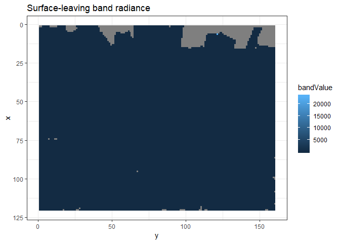
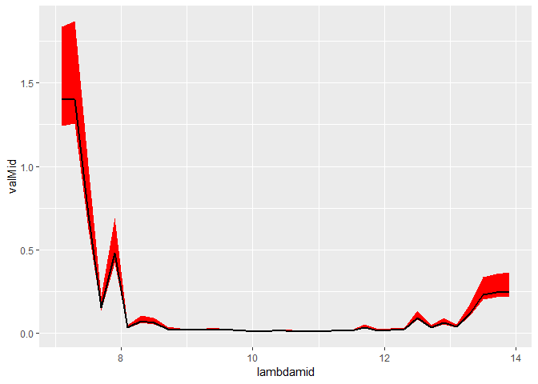
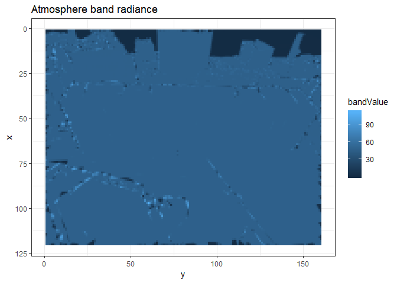

# Summary 

This section demonstrates methods for correcting [real world](../Real-world-images) thermal images using [DART simulation](../DART-simulation) results. 


```r
library(daRt)
library(dplyr)
library(ggplot2)
simDir <- "../../tutorials/DART-simulation/README_files/DART-simulation/dart-atmos-corr"
sF_trans <- daRt::simulationFilter(product = "images", bands = integer(), iters = "ITERX", 
                                   imageTypes = c("camera_transmittance"), typeNums = "",
                                   variables = "Tapp")
sF_tapp <- sF_trans
imageTypes(sF_tapp) <- "camera"
typeNums(sF_tapp) <- "1_Fluid"

simData_transAtm <- daRt::getData(x = simDir, sF = sF_trans)
simData_tappAtm <- daRt::getData(x = simDir, sF = sF_tapp)
simData_radAtm <- daRt::tappToRadiance(simData_tappAtm)
transDF <- as.data.frame(simData_transAtm)
radDF <- as.data.frame(simData_radAtm)
```


Band calculation trapezoidal approximation:

$$\int_{\lambda=1}^{\lambda=n}d\lambda~L_\lambda R_\lambda\approx\sum_{i=1}^n \frac{1}{2} \Bigg[\Big[\frac{1}{2}(\lambda_{max_{i}}-\lambda_{min_{i}})\Big]\times(L_{\lambda_{i}}R_{min_{i}}+ L_{\lambda_{i}}R_{mid_{i}}+L_{\lambda_{i}}R_{mid_{i}}+L_{\lambda_{i}}R_{max_{i}})\Bigg]$$

Define the real world observations. This should be a data frame which has information that can relate to the model world observations. Namely: pixels (x, y), brightness temperature (value), the image type (imgType) and DART image number that models its perspective (imageNo). This way, each model world camera is matched to the correct real world camera.

Todo: make formal `Thermograph` class to check validity and enable relevant methods e.g. spectralRadiance(tapp, simData[opt], lambda[opt]). 

```r
DFobs <- expand.grid(x = unique(transDF$x), y = unique(transDF$y), value = 300, imgType = "camera", imageNo = 251)
```

The user should also have a spectral response function that spans the [DART simulation](../DART-simulation) bands. It can be sparsely/heterogeneously populated with data and it will be linearly interpolated to exactly match the required bands.


```r
SRF_raw <- read.table("README_files/data/SRF.txt", col.names = c("lambda", "value"))
```

WIP. Tapp to spectral radiance


```r
LcamSpectral <- thermographToSpectralRadiance(thermograph = DFobs, simData = simData_radAtm)
```

WIP. Perform band calculation. 
- Tidy up inputs to bandRadiance_surf()? e.g. 
- LCam_spectralBrick check is a valid data frame 
- thermographToSpectralRadiance() can be internal. 
- validate with paper results


```r
bandRadDF <- bandRadiance_surf(LCam_spectralBrick = LcamSpectral, 
                               simData_transAtm = simData_transAtm, 
                               simData_radAtm = simData_radAtm, 
                               SRF_raw = SRF_raw)
```


```r
ggplot(bandRadDF %>% filter(between(bandValue, 48, 52))) +
  geom_raster(aes(x = x, y = y, fill = bandValue)) +
  theme_bw() +
  coord_flip() +
  scale_x_reverse() +
  ggtitle("At-sensor surface leaving band radiance")
```




```r
library(raster)
```

```
## Warning: package 'raster' was built under R version 3.4.4
```

```
## Loading required package: sp
```

```
## Warning: package 'sp' was built under R version 3.4.4
```

```
## 
## Attaching package: 'raster'
```

```
## The following object is masked from 'package:data.table':
## 
##     shift
```

```
## The following object is masked from 'package:dplyr':
## 
##     select
```

```
## The following object is masked from 'package:daRt':
## 
##     getData
```

```r
SRF <- SRFinterp(SRF_raw = SRF_raw, simData = simData_radAtm)
radAtmSpectral <- as.data.frame(simData_radAtm) %>%
  dplyr::left_join(wavelengths(simData_radAtm))
```

```
## Joining, by = c("band", "simName")
```

```r
radAtmBand <- getBandRadiance(spectralDF = radAtmSpectral, SRF = SRF)

ggplot(radAtmSpectral %>% 
         group_by(lambdamid, add = TRUE) %>% 
         summarise(valMin = quantile(value, 0.1),
                   valMid = quantile(value, 0.5), 
                   valMax = quantile(value, 0.9))) +
  geom_ribbon(aes(x = lambdamid, ymin = valMin, ymax = valMax), fill = "red") +
  geom_line(aes(x = lambdamid, y = valMid), colour = "black", size = 0.75)
```



```r
ggplot(radAtmBand) +
  geom_raster(aes(x = x, y = y, fill = bandValue)) +
  theme_bw() +
  coord_flip() +
  scale_x_reverse() +
  ggtitle("At-sensor atmospheric band radiance")
```


