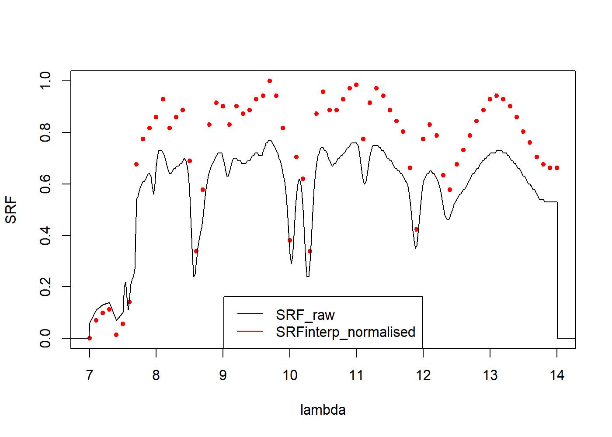

WIP band integration etc. 


```r
library(daRt)
library(dplyr)
library(ggplot2)
simDir <- "../../tutorials/DART-simulation/README_files/DART-simulation/dart-atmos-corr"

sF_trans <- daRt::simulationFilter(product = "images", bands = integer(), iters = "ITERX", 
                                   imageTypes = c("camera_transmittance"), typeNums = "",
                                   variables = "Tapp")
sF_tapp <- sF_trans
imageTypes(sF_tapp) <- "camera"
typeNums(sF_tapp) <- "1_Fluid"

simData_transAtm <- daRt::getData(x = simDir, sF = sF_trans)
simData_tappAtm <- daRt::getData(x = simDir, sF = sF_tapp)
simData_radAtm <- daRt::tappToRadiance(simData_tappAtm)
transDF <- as.data.frame(simData_transAtm)
radDF <- as.data.frame(simData_radAtm)
```


```r
DFobs <- expand.grid(x = unique(transDF$x), y = unique(transDF$y), value = 300)

SRF_raw <- data.frame("lambda" = seq(5, 20, by = 1e-3), "value" = seq(1, 1, length.out = length(seq(5, 20, by = 1e-3))))

LcamSpectral <- thermographToSpectralRadiance(thermograph = DFobs, simData = simData_radAtm)

bandRadDF <- bandRadiance_surf(LCam_spectralBrick = LcamSpectral, simData_transAtm = simData_transAtm, simData_radAtm = simData_radAtm, SRF_raw = SRF_raw)
```


```r
ggplot(bandRadDF %>% filter(between(bandValue, 130, 150))) +
  geom_raster(aes(x = x, y = y, fill = bandValue)) +
  theme_bw() +
  coord_flip() +
  scale_x_reverse() +
  ggtitle("Surface-leaving band radiance")
```

<!-- -->
