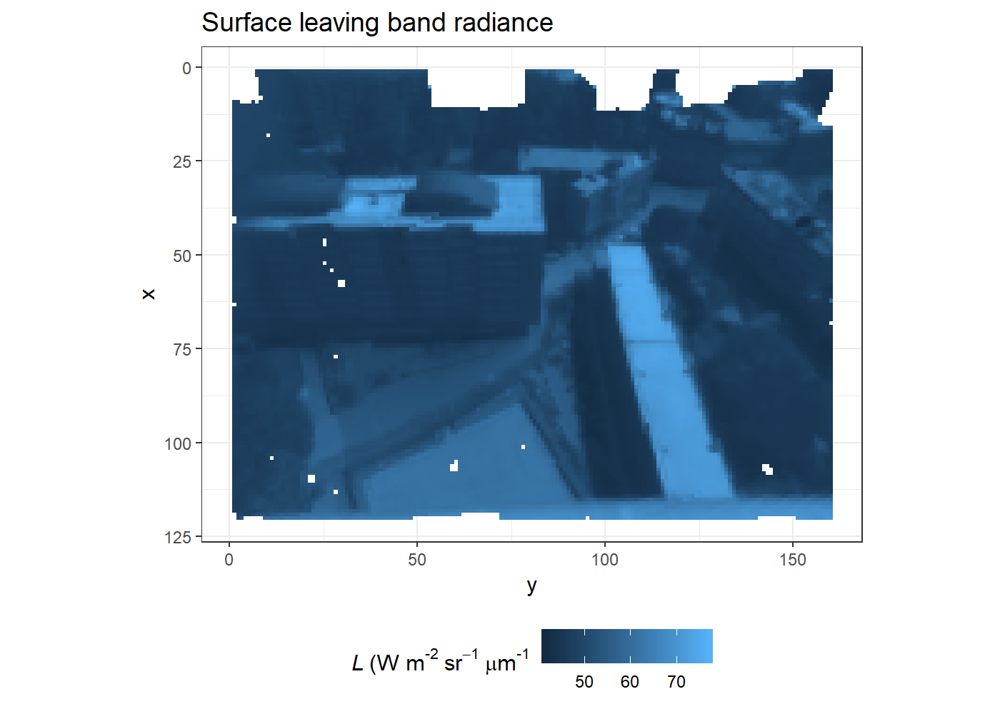
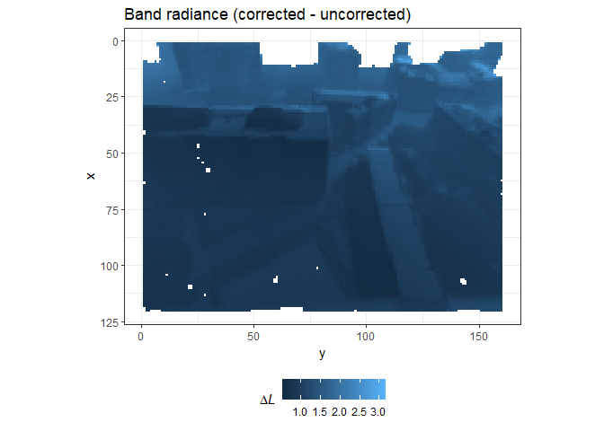

# Summary 

This section demonstrates methods for correcting [real world](../Real-world-images) thermal images using [DART simulation](../DART-simulation) results. The [script files](README_files/code) contain the code for the functions executed below.

# Load DART data


```r
library(daRt)
library(dplyr)
library(ggplot2)
simDir <- "../../tutorials/DART-simulation/README_files/DART-simulation/dart-atmos-corr"
sF_trans <- daRt::simulationFilter(product = "images", bands = integer(), iters = "ITERX", 
                                   imageTypes = c("camera_transmittance"), typeNums = "",
                                   variables = "Tapp")
sF_tapp <- sF_trans
imageTypes(sF_tapp) <- "camera"
typeNums(sF_tapp) <- "1_Fluid"

simData_transAtm <- daRt::getData(x = simDir, sF = sF_trans)
simData_tappAtm <- daRt::getData(x = simDir, sF = sF_tapp)
simData_radAtm <- daRt::tappToRadiance(simData_tappAtm)
transDF <- as.data.frame(simData_transAtm)
radDF <- as.data.frame(simData_radAtm)
```

Source the functions that are used to demonstrate the band calculation and corrections.


```r
source("README_files/code/functions.R")
```

# Real world observations 

Define the real world observations. This should be a data frame which has information that can relate to the model world observations. Namely: pixels (x, y), brightness temperature (value), the image type (imgType) and DART image number that models its perspective (imageNo). This way, each model world camera is matched to the correct real world camera. Therefore, read the data as was done in the [real world](../Real-world-images) section and add the appropriate meta data.


```r
library(reshape2)
library(ggplot2)
library(dplyr)
library(tidyr)
library(raster)
rawData <- raster("../Real-world-images/README_files/data/C17_sampleImg.tif")
DFobs <- melt(as.matrix(rawData), varnames = c("x", "y")) %>%
  dplyr::mutate(imgType = "camera", imageNo = 251L)
```

# Spectral response function

The user should also have a spectral response function _R_ that spans the [DART simulation](../DART-simulation) bands. It can be sparsely/heterogeneously populated with data and it will be linearly interpolated to exactly match the required bands.


```r
SRF_raw <- read.table("README_files/data/SRF.txt", col.names = c("lambda", "value"))
SRF <- SRFinterp(SRF_raw, simData_tappAtm)
plot(c(SRF$lambdamin,SRF$lambdamid, SRF$lambdamax),
     c(SRF$lambdamin_SRF, SRF$lambdamid_SRF, SRF$lambdamax_SRF), 
     col = "red", xlab = "lambda", ylab = "SRF", ylim = c(0, 1), pch = 20)
lines(SRF_raw)
legend("bottom", legend = c("SRF_raw", "SRFinterp_normalised"), col = c("black", "red"), lty = 1)
```

<!-- -->

# Band calculation

The band calculations use a trapezoidal approximation:
<!-- https://www.latex4technics.com -->
<!-- $$\int_{\lambda=1}^{\lambda=n} d\lambda L_\lambda R_\lambda \approx \sum_{i=1}^n \frac{1}{2} \Bigg[\Big[\frac{1}{2} (\lambda_{max_{i}} - \lambda_{min_{i}})\Big] \times (L_{\lambda_{i}} R_{min_{i}} + L_{\lambda_{i}} R_{mid_{i}} + L_{\lambda_{i}} R_{mid_{i}} + L_{\lambda_{i}} R_{max_{i}} ) \Bigg]$$ -->


where _R_ is the spectral response function, lambda is wavelength, _L_ is the radiance, _i_ is the band index, _n_ is the number of bands, and subscript _min_ _mid_ _max_ refer to the minimum, central and maximum wavelength for each DART simulation band. DART computes the average optical properties across each band, and uses the central wavelength (i.e. it does no integration across the full band width during simulation). 

Convert the observations into spectral radiances across the wavelengths within the simulation.


```r
LcamSpectral <- thermographToSpectralRadiance(thermograph = DFobs, simData = simData_radAtm)
```

With the DART simulation data and correctly configured observations, correct the observations for atmospheric effects.


```r
bandRadDF <- bandRadiance_surf(LCam_spectralBrick = LcamSpectral, 
                               simData_transAtm = simData_transAtm, 
                               simData_radAtm = simData_radAtm, 
                               SRF_raw = SRF_raw)

#a workaround for lack of Arith() methods!
simData_transAtm@data$value <- 1
simData_radAtm@data$value <- 0
bandRadDF_noAtm <- bandRadiance_surf(LCam_spectralBrick = LcamSpectral, 
                               simData_transAtm = simData_transAtm, 
                               simData_radAtm = simData_radAtm, 
                               SRF_raw = SRF_raw)
```

and plot the corrected surface-leaving band radiance (cf. uncorrected at-sensor band radiance).

```r
ggplot(bandRadDF %>% filter(between(bandValue, 30, 85))) +
  geom_raster(aes(x = x, y = y, fill = bandValue)) +
  theme_bw() +
  coord_flip() +
  scale_x_reverse() +
  ggtitle("At-sensor surface leaving band radiance") +
  labs(fill = expression(italic(L)~"(W m"^"-2"~sr^-1~mu*m^"-1")) +
  theme(aspect.ratio = 120 / 160) +
  theme(legend.position = "bottom")
```

<!-- -->

```r
diffDF <- bandRadDF %>% 
  dplyr::rename(bandValueAtm = bandValue) %>%
  dplyr::left_join(bandRadDF_noAtm)
```

```
## Joining, by = c("typeNum.x", "x", "y", "iter", "imgType", "imageNo", "VZ", "VA", "simName", "typeNum.y", "bandValue_Latm")
```

```r
ggplot(diffDF %>% 
         filter(between(bandValueAtm - bandValue, 0, 3.5))) +
  geom_raster(aes(x = x, y = y, fill = bandValueAtm - bandValue)) +
  theme_bw() +
  coord_flip() +
  scale_x_reverse() +
  ggtitle("Band radiance (corrected - uncorrected)") +
  labs(fill = expression(Delta*italic(L))) +
  theme(aspect.ratio = 120 / 160) +
  theme(legend.position = "bottom")
```

<!-- -->

To convert the band radiance back to temperature, a band radiance to temperature function needs to be created. Band radiance is related to temperature using the following equation:
<!-- $$L = \int_{\lambda=7\mu m}^{\lambda=14\mu m} d\lambda~R_\lambda B_\lambda(T)$$ -->


where _L_ is the band radiance, _R_ is the spectral response function and _B_ is the planck function. Across a range of temperatures, a polynomial regression can befound with _L_.
