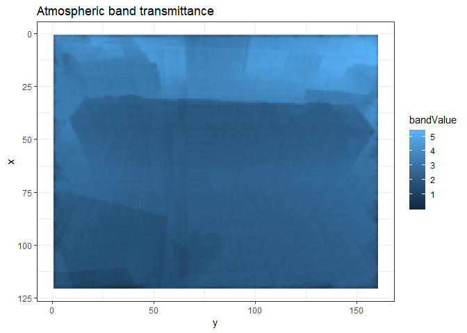

# Summary 

This tutorial outlines the configuration of the DART model for creation of atmospheric emission and transmissivity of the air between surfaces and a camera, throught the perspective of a [model world](../Model-world) camera.

# DART model configuration

The DART simulation template can be found [here TO ADD](README_files/).

## Import 3D model

Import the 3D model into the DART simulation and put it in the middle of the DART scene.


## DART camera - location coordinates

For a model world camera with XYZ location

```
X[mw] = -28.553
Y[mw] = -27.9681
Z[mw] =  87.1
```

with the world coordinate origin in the center of the scene, the comparable DART camera coordinates are

```
X[dart] = (max(Y[dart]) / 2) + Y[mw]
Y[dart] = (max(X[dart]) / 2) + X[mw]
Z[dart] =  Z[mw]
```
becuase the DART world coordinate origin is in the "top left" and the X and Y axes are opposite to that of Blender. 


```r
Xdart_max <- Ydart_max <- 300
Xmw <- -28.553
Ymw <- -27.9681
Xdart <- (Xdart_max / 2) + Ymw
Ydart <- (Ydart_max / 2) + Xmw
```


```r
print(Xdart)
```

```
## [1] 122.0319
```

```r
print(Ydart)
```

```
## [1] 121.447
```

## DART camera - rotation vector

### Inside scene camera

The DART camera rotation can be directly translated from the Blender coordinates when using the "inside scene" camera. 

### Frame camera

When using a camera above the tallest model world surface, the "frame camera" should be used. With the Blender rotation order as XZY, set the DART frame camera rotation order to XZY. The Blender camera rotation vector (X[mw]... etc) is related to DART frame camera rotation by: 

```
X[dart] = X[mw]
Y[dart] = Z[mw]
Z[dart] = -Y[mw]
```

# Read DART data


```r
library(daRt)
library(dplyr)
```

```
## 
## Attaching package: 'dplyr'
```

```
## The following objects are masked from 'package:stats':
## 
##     filter, lag
```

```
## The following objects are masked from 'package:base':
## 
##     intersect, setdiff, setequal, union
```

```r
library(ggplot2)
print( getwd())
```

```
## [1] "C:/Users/micromet/Documents/GitHub/dart-atmos-corr/tutorials/DART-simulation"
```

```r
simDir <- "README_files/DART-simulation/dart-atmos-corr"

sF_trans <- daRt::simulationFilter(product = "images", bands = integer(), iters = "ITERX", 
                                   imageTypes = c("camera_transmittance"), typeNums = "",
                                   variables = "Tapp")
sF_tapp <- sF_trans
imageTypes(sF_tapp) <- "camera"
typeNums(sF_tapp) <- "1_Fluid"

simData_trans <- daRt::getData(x = simDir, sF = sF_trans)
```

```
## Loading required package: xml2
```

```
## Warning: The `printer` argument is deprecated as of rlang 0.3.0.
## This warning is displayed once per session.
```

```
## Loading required package: stringr
```

```
## Loading required package: foreach
```

```
## Loading required package: parallel
```

```
## Loading required package: doParallel
```

```
## Loading required package: iterators
```

```
## Loading required package: reshape2
```

```
## Loading required package: data.table
```

```
## 
## Attaching package: 'data.table'
```

```
## The following objects are masked from 'package:reshape2':
## 
##     dcast, melt
```

```
## The following objects are masked from 'package:dplyr':
## 
##     between, first, last
```

```r
simData_tapp <- daRt::getData(x = simDir, sF = sF_tapp)

simData_rad <- tappToRadiance(simData_tapp)
```

```
## Loading required package: tibble
```

```
## Joining, by = c("band", "simName")
```

```
## Warning: Column `simName` joining factor and character vector, coercing
## into character vector
```

```r
transDF <- as.data.frame(simData_trans)
transDF$value[transDF$value == 0] <- NA
radDF <- as.data.frame(simData_rad)
radDF$value[radDF$value == 0] <- NA
```

Now plot the data.

```r
plotThemes <- theme(
  axis.text = element_blank(),
  axis.title = element_blank(),
  axis.ticks = element_blank(), 
  panel.spacing = unit(0.1, "lines"),
  strip.text = element_text(size = 5, margin = margin(0, 0, 0, 0)),
  strip.background = element_rect(fill = "white", margin(0, 0, 0, 0)),
  aspect.ratio = 120 / 160
)

ggplot(transDF) +
  geom_raster(aes(x = x, y = y, fill = value)) +
  facet_wrap(~ band, ncol = 7) +
  theme_bw() +
  plotThemes +
  coord_flip() +
  scale_x_reverse() +
  ggtitle("Atmospheric spectral transmittance")
```

<!-- -->

```r
ggplot(radDF) +
  geom_raster(aes(x = x, y = y, fill = value)) +
  facet_wrap(~ band, ncol = 7) +
  theme_bw() +
  plotThemes +
  coord_flip() +
  scale_x_reverse() +
  ggtitle("Atmospheric spectral radiance")
```

<!-- -->


```r
SRF_raw <- data.frame("lambda" = seq(5, 20, by = 1e-5), "value" = seq(1, 1, length.out = length(seq(5, 20, by = 1e-5))))
```


simData_trans


```r
SRFinterp <- function(SRF_raw, simData, sigFig = 4) {
  
  require(dplyr)
  require(imputeTS)
  
  #todo - normalise
  #todo - check within min and max
  
  lambdaCols <- c("lambdamin", "lambdamid", "lambdamax", "equivalentWavelength")
  wavelengthVals <- wavelengths(simData)
  wavelengthVals[, lambdaCols] <- round(wavelengthVals[, lambdaCols], sigFig)
  SRF_raw_edited <- SRF_raw %>%
    dplyr::mutate(lambda = round(lambda, sigFig)) %>%
    dplyr::filter(!duplicated(lambda))
  minMaxPer <- sapply(wavelengthVals[, lambdaCols], function(x) 
    c(min(x, na.rm = TRUE), max(x, na.rm = TRUE)))
  minMaxAll <- apply(minMaxPer, 1, function(x) 
    c(min(x, na.rm = TRUE), max(x, na.rm = TRUE)))
  lambdaOUTall <- seq(minMaxAll[, 1][1], minMaxAll[, 2][2], by = 1 * 10^-(sigFig))
  dfOUT <- data.frame(lambda = lambdaOUTall) %>%
    dplyr::mutate(lambda = round(lambda, sigFig)) %>%
    dplyr::filter(!duplicated(lambda))
  
  lambdaDF <- dfOUT %>% 
    dplyr::left_join(SRF_raw_edited, by = "lambda") %>%
    dplyr::mutate(value = imputeTS::na_interpolation(value))
  
  wavelengthOut <- wavelengthVals
  
  for (lambdaCol in lambdaCols) {
    lambdaDFout <- lambdaDF
    colnames(lambdaDFout) <- c(lambdaCol, paste0(lambdaCol, "_SRF"))
    wavelengthOut <- wavelengthOut %>%
      dplyr::left_join(lambdaDFout, by = lambdaCol)
  }
  
  wavelengthOutDF <- dplyr::bind_cols(wavelengthOut)
  
  return(wavelengthOutDF)
}
#check this band integration with prior implementation (DART_imgInfo())
SRFinterpVals <- SRFinterp(SRF_raw = SRF_raw, simData = simData_trans)
```

```
## Loading required package: imputeTS
```

```
## Warning: package 'imputeTS' was built under R version 3.5.3
```

```r
dataDF <- radDF
dataDF <- dataDF %>% 
  dplyr::left_join(SRFinterpVals, by = c("band", "simName"))
LHS <- dataDF$value * dataDF$lambdamin_SRF + dataDF$value * dataDF$lambdamid_SRF
#get integrals for RHS of SRF - for each band
RHS <- dataDF$value * dataDF$lambdamid_SRF + dataDF$value * dataDF$lambdamax_SRF
integral <- (LHS + RHS) * (dataDF$lambdamax - dataDF$lambdamin) * 0.5

dataDF$integral <- integral

dataDF_out <- dataDF %>%
    dplyr::group_by(x, y, iter, imgType, imageNo, VZ, VA) %>%
    dplyr::summarise(bandValue = sum(integral, na.rm = TRUE))

ggplot(dataDF_out %>% filter(bandValue > 0)) +
  geom_raster(aes(x = x, y = y, fill = bandValue)) +
  theme_bw() +
  coord_flip() +
  scale_x_reverse() +
  ggtitle("Atmospheric band transmittance")
```

<!-- -->
