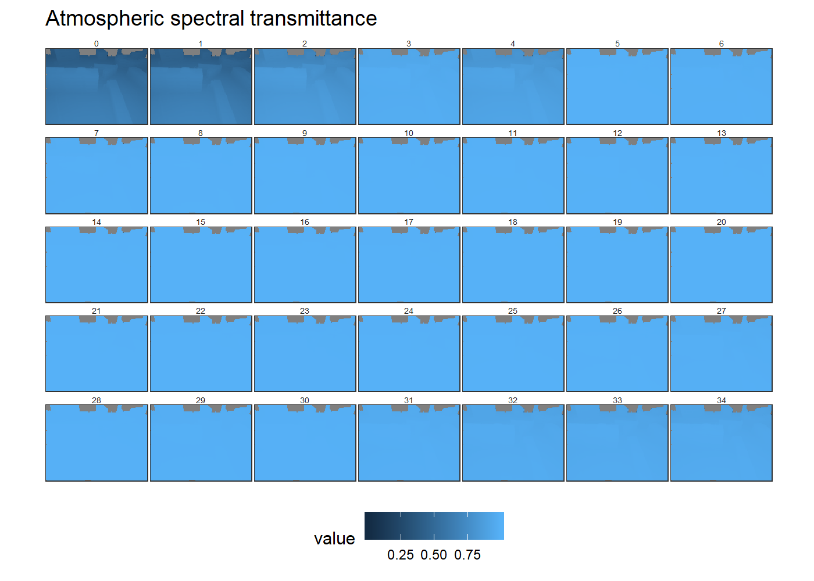

# Summary 

This tutorial outlines the configuration of the DART model for creation of atmospheric emission and transmissivity of the air between surfaces and a camera, throught the perspective of a [model world](../Model-world) camera.

# DART model configuration

The DART simulation template can be found [here](README_files/DART-simulation).

## Import 3D model

Import the 3D model that was used in the [model world](../Model-world) section into the DART simulation and put it in the middle of the DART scene.

## DART camera - location coordinates

For a model world camera with XYZ location:

```
X[mw] = -28.553
Y[mw] = -27.9681
Z[mw] =  87.1
```

with the world coordinate origin in the center of the scene, the comparable DART camera coordinates are:

```
X[dart] = (max(Y[dart]) / 2) + Y[mw]
Y[dart] = (max(X[dart]) / 2) + X[mw]
Z[dart] =  Z[mw]
```
becuase the DART world coordinate origin is in the "top left" and the X and Y axes are opposite to that of Blender. For the [model world](../Model-world) camera example, this requires the following calculation:


```r
Xdart_max <- Ydart_max <- 300
Xmw <- -28.553
Ymw <- -27.9681
Xdart <- (Xdart_max / 2) + Ymw
Ydart <- (Ydart_max / 2) + Xmw
```
which gives the following DART coordinates:


```r
print(Xdart)
```

```
## [1] 122.0319
```

```r
print(Ydart)
```

```
## [1] 121.447
```

## DART camera - rotation vector

### Inside scene camera

The DART camera rotation can be directly translated from the [model world](../Model-world) Blender coordinates when using the "inside scene" camera. 

### Frame camera

When using a camera that is located above the tallest model world surface, the camera is above the model world and the "frame camera" should be used. With the Blender rotation order as XZY, set the DART frame camera rotation order to XZY. The Blender camera rotation vector (X[mw]... etc) is related to DART frame camera rotation by: 

```
X[dart] = X[mw]
Y[dart] = Z[mw]
Z[dart] = -Y[mw]
```

# Read DART data


```r
library(daRt)
library(dplyr)
library(ggplot2)
simDir <- "README_files/DART-simulation/dart-atmos-corr"

sF_trans <- daRt::simulationFilter(product = "images", bands = integer(), iters = "ITERX", 
                                   imageTypes = c("camera_transmittance"), typeNums = "",
                                   variables = "Tapp")
sF_tapp <- sF_trans
imageTypes(sF_tapp) <- "camera"
typeNums(sF_tapp) <- "1_Fluid"

simData_transAtm <- daRt::getData(x = simDir, sF = sF_trans)
simData_tappAtm <- daRt::getData(x = simDir, sF = sF_tapp)
simData_radAtm <- daRt::tappToRadiance(simData_tappAtm)
```

```
## Warning: Column `simName` joining factor and character vector, coercing
## into character vector
```

```r
transDF <- as.data.frame(simData_transAtm)
transDF$value[transDF$value == 0] <- NA
radDF <- as.data.frame(simData_radAtm)
radDF$value[radDF$value == 0] <- NA
```

Now plot the data.

```r
plotThemes <- theme(
  axis.text = element_blank(),
  axis.title = element_blank(),
  axis.ticks = element_blank(), 
  panel.spacing = unit(0.1, "lines"),
  strip.text = element_text(size = 5, margin = margin(0, 0, 0, 0)),
  strip.background = element_rect(fill = "white", margin(0, 0, 0, 0)),
  aspect.ratio = 120 / 160
)

ggplot(transDF) +
  geom_raster(aes(x = x, y = y, fill = value)) +
  facet_wrap(~ band, ncol = 7) +
  theme_bw() +
  plotThemes +
  coord_flip() +
  scale_x_reverse(expand = c(0, 0)) +
  scale_y_continuous(expand = c(0, 0)) +
  ggtitle("Atmospheric spectral transmittance")
```

<!-- -->

```r
ggplot(radDF) +
  geom_raster(aes(x = x, y = y, fill = value)) +
  facet_wrap(~ band, ncol = 7) +
  theme_bw() +
  plotThemes +
  coord_flip() +
  scale_x_reverse(expand = c(0, 0)) +
  scale_y_continuous(expand = c(0, 0)) +
  ggtitle("Atmospheric spectral radiance")
```

<!-- -->

