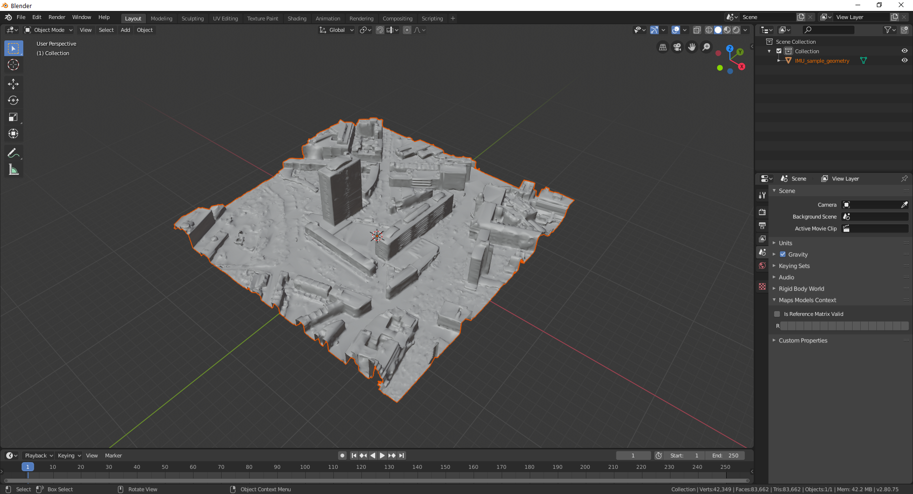

#Model world definition and creation

#Summary

The "model world" forms the basis of the three-dimensional environment used to perform the atmospheric correction for complex camera and terrain configurations. It is created using the [Blender](https://www.blender.org/) rendering software and facilitates the correct interpretation of:

1. Three-dimensional surface geometry
2. Camera intrinsic (e.g. focal length) and extrinsic (location, rotation) parameters

In this tutorial, a model world will be created for the [real world camera image example](../Real-world-images). The tutorial has been tested using Blender v2.80.

#Load geometry

The sample geometry data is found [here](README_files/geoemtry/). In a new Blender session:
- Delete all existing objects (camera, cube, etc)
- Load [IMU_sample_geometry.obj](README_files/geoemtry/IMU_sample_geometry.obj) in Blender

You will be presented with the following GUI

