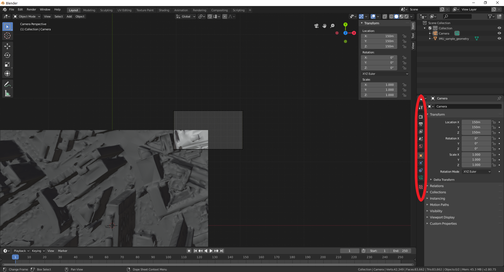

# Summary

The "model world" forms the basis of the three-dimensional (3D) environment used to perform the atmospheric correction for complex camera and terrain configurations. It is created using the [Blender](https://www.blender.org/) rendering software and facilitates the correct interpretation of:

1. 3D surface geometry
2. Camera intrinsic (e.g. focal length) and extrinsic (location, rotation) parameters

Given the cameras used here are static, photogrammetry techniques such as structure from motion cannot easily be used to automatically determine the location and rotation of 'model world' cameras in the 'model world' space. Therefore, 3D geometry is loaded into the rendering software and camera parameters are prescribed and manually adjusted set to give accurate 'model world' perspectives of the [real world cameras](../Real-world-images).   

In this tutorial, a model world will be created for the [real world camera image example](../Real-world-images). The tutorial has been tested using Blender v2.80 and has the [completed tutorial environment](README_files/geometry/model-world.blend).

# Geometry

## Import

The sample geometry data is found [here](README_files/geometry). In a new Blender session:

1. Delete all existing objects (camera, cube, etc)
2. Import [IMU_sample_geometry.obj](README_files/geometry/IMU_sample_geometry.obj)

## Examine

You will be presented with the following GUI. The colours represent the different surface types (orientation and material). Pan around the scene with the mouse and holding down the middle mouse button.


# Camera

## New Camera

Insert a new "camera" into the scene.

```
Shift + "a" -> "Camera"
```

## Extrinsic parameters

Select the the camera (click on it, top right in "scene collection"), press *n*, then you will see the location and rotation XYZ "transform" parameters window.

Modify these 6 parameters to have X = Y = Z = 100 world coordinates and rotation X = Y = Z = 0 3D vector elements. To view the newly altered geometry through the camera viewport, left click on the central window (the 'user perspective') and press

```
Crtl + Numpad0
```

which gives a camera perspective looking directly downwards onto the scene. The center of the camera (camera axis) intersects the top right (X = Y = 100) corner of the 3D model. This is **not** the X = Y = 100 DART coordinates. 


The [real world camera example](../Real-world-images) has location:

```
X = -28.553
Y = -27.9681
Z =  87.1
```

and translation (rotation order XZY):


```
X =  79.684
Y =  33.404
Z = -96.558
```

which were approximated by field measurements and fine adjusted by entering the camera viewport and pressing

```
shift + `
```
to allow the user to manually move the camera with the mouse when a semi-transparent 'background image' from the real world camera was displayed across the camera perspective (details not shown in this guide).

## Intrinsic values

After selecting the camera in the scene collection window, navigate the icons in the [red circle](BlenderGUI_read3Dmodel) to set:

* **Number of pixels** The tab with the printer icon ('Output').
* **Field of view** The tab with the green film camera icon ('Object data').

The real world camera has resolution:

```
Xpx = 160 px
Ypx = 120 px
```

focal length:

```
f = 29.3 mm
```

sensor width and height:

```
W = 40 mm 
H = 30 mm
```

