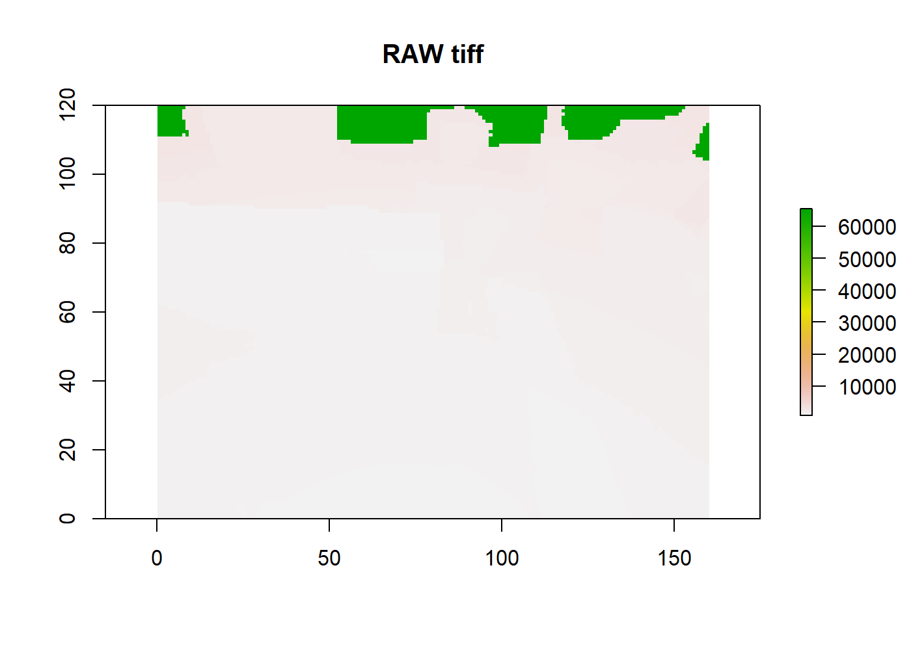
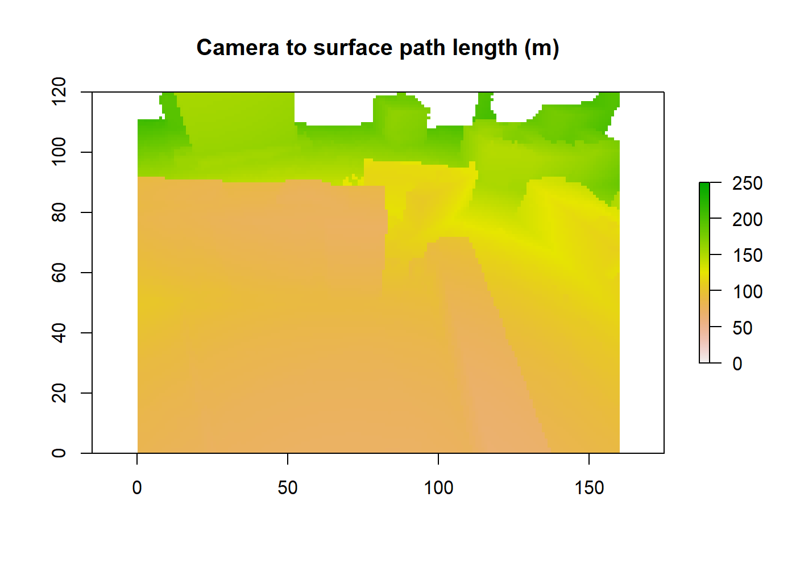

# Summary

Blender is used to create image masks with surface to camera path length information using the [model world ](../Model-world).

# Execution

Define your blender executable path

```
C:\Program Files\Blender Foundation\Blender\blender.exe
```

Define the model world `.blend` file path as created [here](../Model-world) and available [here](../Model-world/geometry/model-world.blend).

```
"tutorials\Model-world\README_files\geometry\model-world.blend"

```
Define the python script location to be used by Blender to get the surface to camera path length information: [writeCameraPathLengths.py](code/writeCameraPathLengths.py).

```
"tutorials\Multi-line-of-sight-images\code\writeCameraPathLengths.py"

This script can be modified with various rendering paramters (e.g. image resolution). By default it conforms to the 
[real world image](../Real-world-images).

```
Execute the following command (will require modification based on your file locations) in a command line:

```
"C:\Program Files\Blender Foundation\Blender\blender.exe" -b "tutorials\Model-world\README_files\geometry\model-world.blend" -P "tutorials\Multi-line-of-sight-images\code\writeCameraPathLengths.py"
```
  
# Output

The [output file(s)](README_files/figure-misc/Camera.tiff) will be saved in a folder `cameraPathLengths` in the current command line directory.


```r
library(raster)
```

```
## Loading required package: sp
```

```r
plot(raster("README_files/figure-misc/Camera.tiff"), main = "RAW tiff")
```

<!-- -->

The image colourdepth is scaled to 16 bit tiff format. To rescale this to units of m, the files should be loaded and rescaled using the following formula

```
zPath = (RAW / 65535) * renderDistance

```

where `zPath` is the scaled path length (m) `RAW` is the [raw image](README_files/figure-misc/Camera.tiff) and `renderDistance` is the pre-defined render distance set in [writeCameraPathLengths.py](code/writeCameraPathLengths.py) (default 5000 m). 


```r
library(raster)
RAW <- raster("README_files/figure-misc/Camera.tiff")
renderDistance <- 5000 # m
zPath <- (RAW / 65535) * renderDistance
plot(zPath, zlim = c(0, 250), main = "Camera to surface path length (m)")
```

<!-- -->

```r
writeRaster(x = zPath, 
            filename = "README_files/figure-misc/Camera_zPath.tiff", 
            overwrite = TRUE)
```


