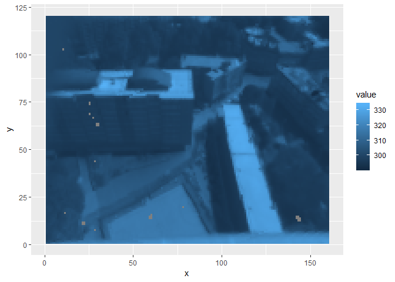

# Summary

This atmospheric correction procedure is shown for ground-based thermal camera observations. The observations are referred to as "real world" observations as not to confuse them with observations [modelled](../../tutorials/DART-simulation) by DART.

# Sample image

The observations shown here are from an Optris PI-160 thermal camera. It is sensitive to radiation between 7 - 14 microns. Observations were taken on top of a high rise building in central London and have an oblique view of the surfaces below. The [sample image](README_files/data/C17_sampleImg.tif) used for this (and a later) tutorial was taken around midday on 27th August 2017.


```r
library(reshape2)
library(ggplot2)
library(dplyr)
library(tidyr)
library(raster)
rawData <- raster("README_files/data/C17_sampleImg.tif")
dataDF <- melt(as.matrix(rawData), varnames = c("x", "y"))

ggplot(dataDF) +
  geom_raster(aes(x = x, y = y, fill = value)) +
    coord_flip() +
  scale_x_reverse()
```

<!-- -->

The grey areas are "dead pixels" that were removed as a quality control step. The camera has a wide angle lens (~ 72 degrees) and naturally has a barrel-shaped distortion. This was corrected as part of another quality control step to give the rectilinear image shown in the above plot.


